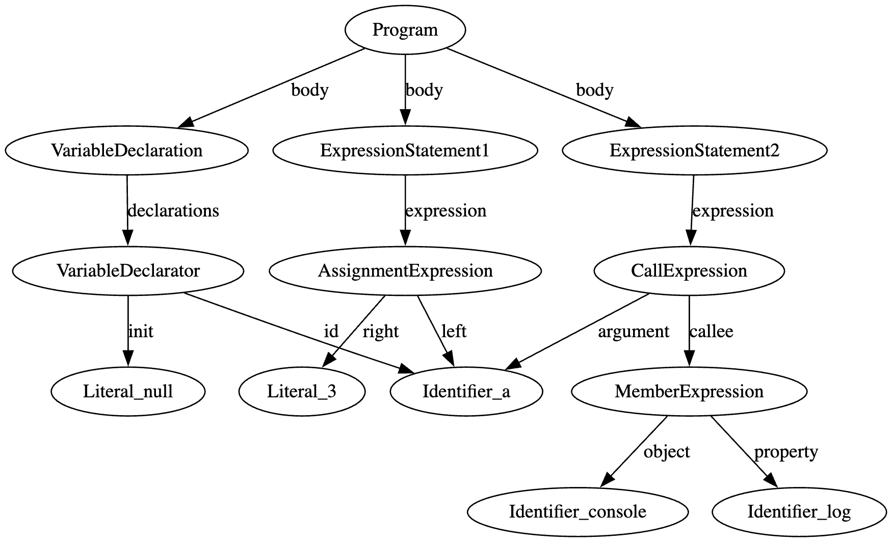

## 全体手順

2つのプログラムに対してASTで表現し、それを図で表現する。

ASTを生成するために、JavaScriptのライブラリである`acorn`を用いた。

また、生成したASTを図で表現するために、ASTを一度dot言語で記述し、graphviz(https://dreampuf.github.io/GraphvizOnline/)を使用した。

### 1つ目のコード

#### acornによるASTの変換

```
import { parse } from "acorn";

const code = `
let a
a
=
3
console.log(a)
`;

const ast = parse(code, {
  ecmaVersion: 2020,
});

console.log(JSON.stringify(ast, null, 2));
```

#### 結果:

```
{
  "type": "Program",
  "start": 0,
  "end": 28,
  "body": [
    {
      "type": "VariableDeclaration",
      "start": 1,
      "end": 6,
      "declarations": [
        {
          "type": "VariableDeclarator",
          "start": 5,
          "end": 6,
          "id": {
            "type": "Identifier",
            "start": 5,
            "end": 6,
            "name": "a"
          },
          "init": null
        }
      ],
      "kind": "let"
    },
    {
      "type": "ExpressionStatement",
      "start": 7,
      "end": 12,
      "expression": {
        "type": "AssignmentExpression",
        "start": 7,
        "end": 12,
        "operator": "=",
        "left": {
          "type": "Identifier",
          "start": 7,
          "end": 8,
          "name": "a"
        },
        "right": {
          "type": "Literal",
          "start": 11,
          "end": 12,
          "value": 3,
          "raw": "3"
        }
      }
    },
    {
      "type": "ExpressionStatement",
      "start": 13,
      "end": 27,
      "expression": {
        "type": "CallExpression",
        "start": 13,
        "end": 27,
        "callee": {
          "type": "MemberExpression",
          "start": 13,
          "end": 24,
          "object": {
            "type": "Identifier",
            "start": 13,
            "end": 20,
            "name": "console"
          },
          "property": {
            "type": "Identifier",
            "start": 21,
            "end": 24,
            "name": "log"
          },
          "computed": false,
          "optional": false
        },
        "arguments": [
          {
            "type": "Identifier",
            "start": 25,
            "end": 26,
            "name": "a"
          }
        ],
        "optional": false
      }
    }
  ],
  "sourceType": "script"
}
```

#### Dot言語への変換

```
digraph AST {
  Program -> VariableDeclaration [label="body"];
  VariableDeclaration -> VariableDeclarator [label="declarations"];
  VariableDeclarator -> Identifier_a [label="id"];
  VariableDeclarator -> Literal_null [label="init"];

  Program -> ExpressionStatement1 [label="body"];
  ExpressionStatement1 -> AssignmentExpression [label="expression"];
  AssignmentExpression -> Identifier_a [label="left"];
  AssignmentExpression -> Literal_3 [label="right"];

  Program -> ExpressionStatement2 [label="body"];
  ExpressionStatement2 -> CallExpression [label="expression"];
  CallExpression -> MemberExpression [label="callee"];
  MemberExpression -> Identifier_console [label="object"];
  MemberExpression -> Identifier_log [label="property"];
  CallExpression -> Identifier_a [label="argument"];
}
```

#### 結果



### 2つ目のコード

#### acornによるASTの変換

```
import { parse } from "acorn";

const code = `
let a; a = 3; console.log(a);
`;

const ast = parse(code, {
  ecmaVersion: 2020,
});

console.log(JSON.stringify(ast, null, 2));

```

#### 結果:

```
{
  "type": "Program",
  "start": 0,
  "end": 31,
  "body": [
    {
      "type": "VariableDeclaration",
      "start": 1,
      "end": 7,
      "declarations": [
        {
          "type": "VariableDeclarator",
          "start": 5,
          "end": 6,
          "id": {
            "type": "Identifier",
            "start": 5,
            "end": 6,
            "name": "a"
          },
          "init": null
        }
      ],
      "kind": "let"
    },
    {
      "type": "ExpressionStatement",
      "start": 8,
      "end": 14,
      "expression": {
        "type": "AssignmentExpression",
        "start": 8,
        "end": 13,
        "operator": "=",
        "left": {
          "type": "Identifier",
          "start": 8,
          "end": 9,
          "name": "a"
        },
        "right": {
          "type": "Literal",
          "start": 12,
          "end": 13,
          "value": 3,
          "raw": "3"
        }
      }
    },
    {
      "type": "ExpressionStatement",
      "start": 15,
      "end": 30,
      "expression": {
        "type": "CallExpression",
        "start": 15,
        "end": 29,
        "callee": {
          "type": "MemberExpression",
          "start": 15,
          "end": 26,
          "object": {
            "type": "Identifier",
            "start": 15,
            "end": 22,
            "name": "console"
          },
          "property": {
            "type": "Identifier",
            "start": 23,
            "end": 26,
            "name": "log"
          },
          "computed": false,
          "optional": false
        },
        "arguments": [
          {
            "type": "Identifier",
            "start": 27,
            "end": 28,
            "name": "a"
          }
        ],
        "optional": false
      }
    }
  ],
  "sourceType": "script"
}
```

#### Dot言語への変換

```
digraph AST {
  Program -> VariableDeclaration [label="body"];
  VariableDeclaration -> VariableDeclarator [label="declarations"];
  VariableDeclarator -> Identifier_a [label="id"];
  VariableDeclarator -> Literal_null [label="init"];

  Program -> ExpressionStatement1 [label="body"];
  ExpressionStatement1 -> AssignmentExpression [label="expression"];
  AssignmentExpression -> Identifier_a [label="left"];
  AssignmentExpression -> Literal_3 [label="right"];

  Program -> ExpressionStatement2 [label="body"];
  ExpressionStatement2 -> CallExpression [label="expression"];
  CallExpression -> MemberExpression [label="callee"];
  MemberExpression -> Identifier_console [label="object"];
  MemberExpression -> Identifier_log [label="property"];
  CallExpression -> Identifier_a [label="argument"];
}
```

#### 結果


