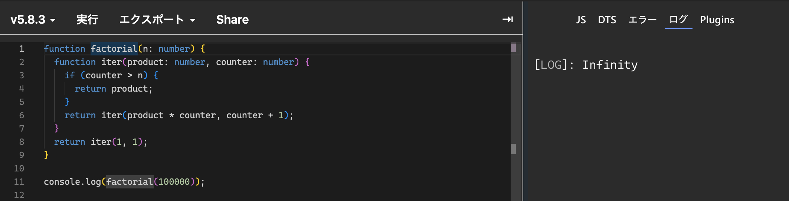

### プログラミング言語や処理系によっては、再帰呼び出しを関数の処理の末尾にする(末尾再帰)ことで、スタックオーバーフローが起こらないよう最適化できるものがある。末尾再帰は何故そのような最適化ができるのか答えなさい。

現在の関数のスタックフレームを再利用できるから。

通常の再起では、関数が再起呼び出しをした後に、戻ってから続きの処理を実行する必要があり、毎回スタックに実行中の状態を積んでおく必要がある。これでは今の関数の実行状態を保存するためメモリ領域を圧迫しスタックオーバーフローにつながる。

一方で、末尾再起では再起呼び出しの後に実行する処理が残っていないため、今の関数の実行状態を保存する必要がなく、今のフレームをそのまま再起呼び出しに利用できる。

### JavaScript で末尾再帰最適化を実装している処理系を答えなさい。

Safariでは、末尾再起最適化が実装されている。
一方でChromeでは実装されていないため、エラーとなった。

[Safariの場合]

[Chromeの場合]

