```mermaid
gantt
  title f12
  dateFormat  s
  axisFormat |
    new Promise :np, 0, 0.1s
    setTimeout(0) :st, after np, 0.1s
    errX(throw Error) :ex, after st, 0.1s
    unhandled Error: X :ue, after ex, 0.1s
```

## f3

### 予想

```
C
A
Error: X
```

### 結果

```
C
A
Error: X(エラー全体は省略)
```

### 説明

wait(0)はPromiseを返し、非同期のためすぐには解決しない。tryブロック内のコードは同期的に進むため、finallyブロックが先に実行され、logC()が呼ばれる。その後wait(0)のPromiseが解決され、logA()が呼ばれ、その後errX()が呼ばれエラーがスローされる。すでにtryブロックは終了しているため、catchブロックは実行されない。

### 図解



```mermaid
gantt
  title f3
  dateFormat  s
  axisFormat |
    wait(0) :w0, 0, 0.1s
    logC    :lc, 0, 0.1s
    logA    :la, after w0, 0.1s
    errX(throw Error) :ex, after la, 0.1s
```

## f4

### 予想

```
A
B
100
```

### 結果

```
A
B
100
```

### 説明

wait2で2秒後の解決後にlogAが実行され、40をreturnする。その後, 次のthenで1秒後にlogBが実行され、100がreturnされる。最後のthenで100がlogされる。

### 図解



```mermaid
gantt
  title f4
  dateFormat  s
  axisFormat |
    wait2(2s) :w2, 0, 2s
    logA      :la, after w2, 0.1s
    wait(1s)  :w1, after la, 1s
    logB      :lb, after w1, 0.1s
    log(100)  :l100, after lb, 0.1s
```

## f5

### 予想

```
A
B
100
```

### 結果

```
A
B
100
```

### 説明

wait2で2秒後の解決後にlogAが実行され、40をreturnする。その後, すぐにwait(1).thenが開始され、1秒後にlogBが実行され、100がreturnされる。最後のthenで100がlogされる。
wait(1).thenとしてしまっていることで、thenのコールバック関数としてPromiseの結果がそのまま使われるため、wait2の解決とは関係なしに呼ばれてしまう。

### 図解


## f6

### 予想

```
A
B
C
```

### 結果

```
A
B
C
```

### 説明

1秒後にlogAが実行され、pが解決される。pが解決されると、2つのp.thenが並列に実行される。pの解決の1秒後にlogBが実行され、pの解決の2秒後にlogCが実行される。

### 図解



```mermaid
gantt
  title f6
  dateFormat  s
  axisFormat |
    wait1(1s) :w1, 0, 1s
    logA      :la, after w1, 0.1s
    wait1(1s) :w1b, after la, 1s
    logB      :lb, after w1b, 0.1s
    wait2(2s) :w2, after la, 2s
    logC      :lc, after w2, 0.1s
```

## f7

### 予想

```
A
B
C
```

### 結果

```
A
B
C
```

### 説明

1秒後にlogAが実行され、pが解決される。
それと同期実行でwait2が呼ばれ、2秒後にp.thenが呼ばれる(pの解決の1秒後)。
2秒後にはp.thenは解決済みのため、すぐにlogBが実行される。
解決後、logCが呼ばれる。

### 図解



```mermaid
gantt
  title f7
  dateFormat  s
  axisFormat |
    wait1(1s) :w1, 0, 1s
    logA      :la, after w1, 0.1s
    wait2(2s) :w2, 0, 2s
    logB      :lb, after w2, 0.1s
    logC      :lc, after lb, 0.1s
```

## f8

### 予想

```
X
A
```

### 結果

```
X
A
```

### 説明

1秒後にerrXが呼ばれ、エラーがスローされる。エラーのため、次のthen(errY)はスキップされる。
promiseチェーンのため、catchブロックが呼ばれ、e.messageがlogされる。
その後finallyブロックが呼ばれ、logAが実行される。

### 図解



```mermaid
gantt
  title f8
  dateFormat  s
  axisFormat |
    wait1(1s) :w1, 0, 1s
    errX(throw Error) :ex, after w1, 0.1s
    catch(log e.message) :c, after ex, 0.1s
    finally(logA) :f, after c, 0.1s
```

## f9

### 予想

```
Y
A
```

### 結果

```
Y
A
```

### 説明

1秒後にwait1が解決され、thenのコールバックが呼ばれ、42が返される。
次のthen(errY)でerrYが呼ばれ、エラーがスローされる。
promiseチェーンのため、catchブロックが呼ばれ、e.messageがlogされる。
その後finallyブロックが呼ばれ、logAが実行される。

### 図解



```mermaid
gantt
  title f9
  dateFormat  s
  axisFormat |
    wait1(1s) :w1, 0, 1s
    then(return 42) :t1, after w1, 0.1s
    errY(throw Error) :ey, after t1, 0.1s
    catch(log e.message) :c, after ey, 0.1s
    finally(logA) :f, after c, 0.1s
```

## f10

### 予想

```
Y
A
```

### 結果

```
A
Error: Y(エラー全体は省略)
```

### 説明

1秒後にwait1が解決され、thenのコールバックが呼ばれ、42が返される。
次のthen(errY, (e) => log(e.message))でエラーが発生するが、第2引数は前のthenでエラーが発生した場合に呼ばれるため、ここでは呼ばれず、Yは出力されない。
その後finallyブロックが呼ばれ、logAが実行される。
最後に未補足のエラーとして、"Error: Y"が出力される。

### 図解



```mermaid
gantt
  title f10
  dateFormat  s
  axisFormat |
    wait1(1s) :w1, 0, 1s
    then(return 42) :t1, after w1, 0.1s
    errY(throw Error) :ey, after t1, 0.1s
    finally(logA) :f, after ey, 0.1s
    unhandled Error: Y :ue, after f, 0.1s
```

## f11

### 予想

```
X
```

### 結果

```
X
```

### 説明

new Promiseの中でerrX()が呼ばれ、エラーがスローされる。このエラーはPromiseの外には伝播せず、catchブロックでキャッチされるため、e.messageが出力される。

### 図解



```mermaid
gantt
  title f11
  dateFormat  s
  axisFormat |
    new Promise :np, 0, 0.1s
    errX(throw Error) :ex, after np, 0.1s
    catch(log e.message) :c, after ex, 0.1s
```

## f12

### 予想

```
Error: X
```

### 結果

```
Error: X(エラー全体は省略)
```

### 説明

new Promiseの中でsetTimeoutで非同期にerrX()が呼ばれる。setTimeout内でスローされたエラーされるが、new Promise自体はthrowしていないため、Promiseは解決されず、catchブロックでキャッチされることもない。そのため、エラーは未補足のままになり、コンソールに出力される。

### 図解


