```mermaid
gantt
  title h4
  dateFormat  s
  axisFormat |
    wait2(2s) :w2, 0, 2s
    wait1(1s) :w1, 0, 1s
    errY(throw Error) :ey, after w1, 0.1s
    unhandled Error(Y) :un, after ey, 0.1s
```

## h1

### 予想

```
A
B
C
```

### 結果

```
A
B
C
```

### 説明

await wait3()で、wait3の完了を待つ。完了したらlogAが実行され、次にawait wait2()でwait2の完了を待つ。完了したらlogBが実行され、次にawait wait1()でwait1の完了を待つ。完了したらlogCが実行される。

### 図解



```mermaid
gantt
  title h1
  dateFormat  s
  axisFormat |
    wait3(3s) :w3, 0, 3s
    logA      :la, after w3, 0.1s
    wait2(2s) :w2, after la, 2s
    logB      :lb, after w2, 0.1s
    wait1(1s) :w1, after lb, 1s
    logC      :lc, after w1, 0.1s
```

## h2

### 予想

```
X
```

### 結果

```
X
```

### 説明

new Promiseの中でerrX()が呼ばれる。例外が発生すると、Promiseのrejectとして扱われ、.catchに捕捉され、logが実行される。

### 図解



```mermaid
gantt
  title h2
  dateFormat  s
  axisFormat |
    errX      :ex, 0, 0.1s
    catch     :ct, after ex, 0.1s
```

## h3

### 予想

```
X
```

### 結果

```
Error: X(エラー全体は省略)
```

### 説明

new Promiseの内部では、同期的な例外のみrejectする。 new Promiseの中をasyncにすると、常にPromiseを返すが、そのPromiseのrejectはその側のPromiseに伝播しない。
errX()が呼ばれ、例外が発生するが、new Promiseの中で発生した非同期の例外は捕捉されず、未補足例外となる。

### 図解



```mermaid
gantt
  title h3
  dateFormat  s
  axisFormat |
    errX      :ex, 0, 0.1s
    unhandled Error :un, after ex, 0.1s

```

## h4

### 予想

```
Y
```

### 結果

```
Error: Y(エラー全体は省略)
```

### 説明

p1とp2は同時に開始される。
await p1でp1の完了を待っている間に,p2が先にrejectされる。
await p2には達していないため、catchブロックには入らず、未補足例外として出力される。

### 図解


