```mermaid
gantt
  title i4
  dateFormat  s
  axisFormat |
    wait1 :wp1, 0, 1s
    wait2 :wp1_1, after wp1, 2s
    v=2   :v2, after wp1_1, 0.1s
    wait2 :wp1_2, after v2, 2s
    v=4   :v4, after wp1_2, 0.1s
    wait2 :wp1_3, after v4, 2s
    v=6   :v6, after wp1_3, 0.1s
    wait2 :wp1_4, after v6, 2s
    v=8   :v8, after wp1_4, 0.1s
    wait2 :wp1_5, after v8, 2s
    v=10  :v10, after wp1_5, 0.1s
    wait2 :wp2_1, 0, 2s
    v=1   :v1, after wp2_1, 0.1s
    wait2 :wp2_2, after v1, 2s
    v=3   :v3, after wp2_2, 0.1s
    wait2 :wp2_3, after v3, 2s
    v=5   :v5, after wp2_3, 0.1s
    wait2 :wp2_4, after v5, 2s
    v=7   :v7, after wp2_4, 0.1s
    wait2 :wp2_5, after v7, 2s
    v=9   :v9, after wp2_5, 0.1s
```

## i1

### 予想

```
42
100
```

### 結果

```
42
100
```

### 説明

Promise.anyはは最初に解決したPromiseの値が返っても、他のPromiseの処理はバックグラウンドで継続される。

Promise.anyに2つのPromiseを渡しているが、1つ目のPromiseは1秒後に解決され、2つ目のPromiseは2秒後に解決される。
wait1が1秒後に解決されるため、42が最初に出力される。
その後、wait2で2秒待機している間に、2つ目のPromiseが解決されるため、vに100が代入され、100が出力される。

### 図解



```mermaid
gantt
    title i1
    dateFormat  s
    axisFormat |
        promise42(1s) :p1, 0, 1s
        log(42)   :l42, after p1, 0.1s
        wait2(2s) :w2, after l42, 2s
        log(100)  :l100, after w2, 0.1s
        promise100(2s) :p2, 0, 2s
```

## i2

### 予想

```
C
B
A
[ 'A', 'B', 'C' ]
```

### 結果

```
C
B
A
[ 'A', 'B', 'C' ]
```

### 説明

Promise.allは全てのPromiseが解決されるまで待機し、解決された値を配列として返す。
3つのPromiseはそれぞれ1秒、2秒、3秒後に解決されるため、1秒後にCが出力され、2秒後にBが出力され、3秒後にAが出力される。
最後に、全てのPromiseが解決された後に、配列['A', 'B', 'C']が出力される。

### 図解



```mermaid
gantt
    title i2
    dateFormat  s
    axisFormat |
        promiseC(1s) :pC, 0, 1s
        log(C)   :lC, after pC, 0.1s
        promiseB(2s) :pB, 0, 2s
        log(B)   :lB, after pB, 0.1s
        promiseA(3s) :pA, 0, 3s
        log(A)   :lA, after pA, 0.1s
        log([A,B,C]) :lABC, after lA, 0.1s
```

## i3

### 予想

```
Y
42
42
```

### 結果

```
Y
42
B
0
```

### 説明

Promise.allの中で1秒後にerrY()でエラーとなるため、Promise.allは失敗を返し、catchブロックが実行される。
catchブロック内のe.messageが出力されるため、Yと0が最初に出力される。
Promise.all内は失敗となっても、バックグラウンドで他のPromiseの処理は継続される。
wait3で3秒待機中にlogBとv=0が実行されるため、Bと0が出力される。

### 図解



```mermaid
gantt
    title i3
    dateFormat  s
    axisFormat |
        Promise0(3s) :p0, 0, 3s
        v=0      :v0, after p0, 0.1s
        promise42(2s) :p42, 0, 2s
        log(B)   :lB, after p42, 0.1s
        promiseY(1s) :pY, 0, 1s
        catch(0.1s) :c, after pY, 0.1s
        log(Y)   :lY, after c, 0.1s
        log(42)   :l42, after lY, 0.1s
        wait3(3s) :w3, after l42, 3s
        log(0)   :l0, after w3, 0.1s
```

## i4

### 予想

```
10
```

### 結果

```
10
```

### 説明

p1とp2はそれぞれ5回ずつvをインクリメントする。
元のコードでは、p1とp2のそれぞれでnextを定義して、一度nextにv+1を代入してから2秒待機してvにnextを代入している。
このため、p1とp2が同時に実行されると、それぞれのnextが独立しているため、p1,p2でのそれぞれの最終的な値は５となる。(値の更新は2秒後のため、p1,p2の各vは0からスタートしている)
変更後のコードでは、vに対して直接値を変更するようにしている。そのため、p1とp2が1秒ずれで交互にvをインクリメントしていき、最終的にvは10になる。

### 図解


