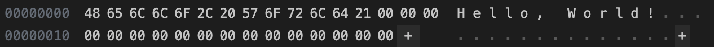

### 実際に fs.truncate() を利用してファイルを拡張し、拡張されたファイルの内容をバイナリエディタ(Stirling や VSCode の HexEditor 拡張機能等)で確認しなさい。

`Hello, World!`という内容のファイル `test.txt`を作成し、`index.js`を実行すると、以下のようにファイルが拡張されていることが確認できた。(HexEditor 拡張機能を利用)

`Hello, World!`は13バイトであり、`fs.truncate()`で30バイトに拡張したため、残りの17バイト分が`00`で埋められていることが確認できる。
