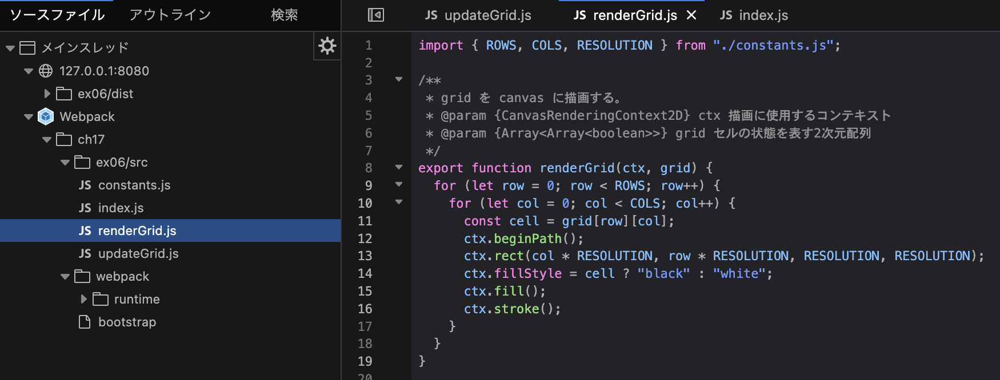
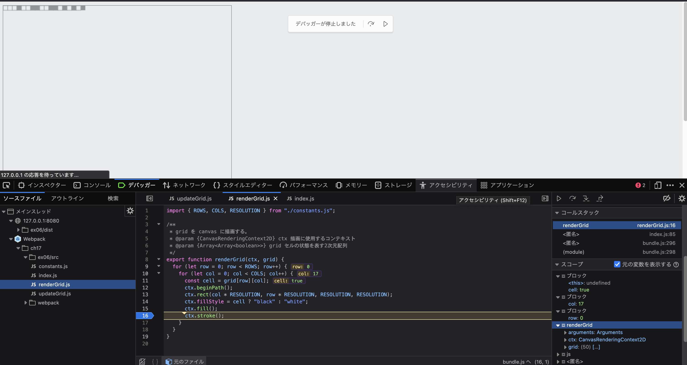

### 開発者ツールで ソース タブ(Chrome, Edge, Safari) または デバッガー タブ(Firefox) を開き、ソースコードファイルがどのように表示されるかを確認しなさい。

webpack.config.jsファイルで`devtool: "source-map",`を追加し、ソースマップを生成するようにした。
ローカルサーバーを起動し、Firefoxのデバッガータブで確認した。
メインスレッドの株に`Webpack`フォルダができており、bundleする前のソースコードファイルが表示されていることを確認した。

### バンドルしたコードの実行中に、バンドル前のソースコードファイルに基づいたブレークポイントの設定や変数の値の確認等のデバッグが可能か確認しなさい

ブレークポイントを設定し、再生ボタンを押下すると、ブレークポイントで処理が停止し、変数の値を確認できた。

